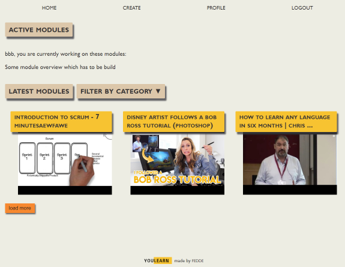
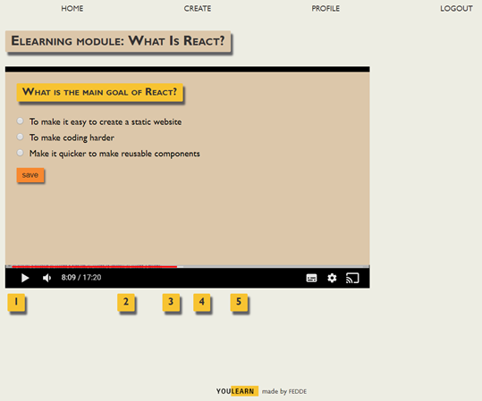

## You Learn - Learn more from Youtube
Turn youtube videos into e-learning modules.

### Current features
- Pull video from youtube and prefill title and description
- Add multiple choice questions at specific times
- Add 2-5 fake answers
- As a user: make e-learnings and save your progress

## Instructions
.env file
- PORT=5000
- ENV=DEVELOPMENT  
- MONGO_PASS=[pass]
- MONGO_USER=[user]
- MONGO_DB_NAME=[db name mongo]
- APP_SESSION_SECRET=[session secret string]
- CORS_ORIGIN=http://localhost:3000
- YOUTUBE_KEY=[youtube API key]

### Wishlist
- Mobile version of video
- Different type of questions
- Scoring
- Profile overview of what you did
- Signin by userID or e-mail
- Countdown (limited time) option for questions